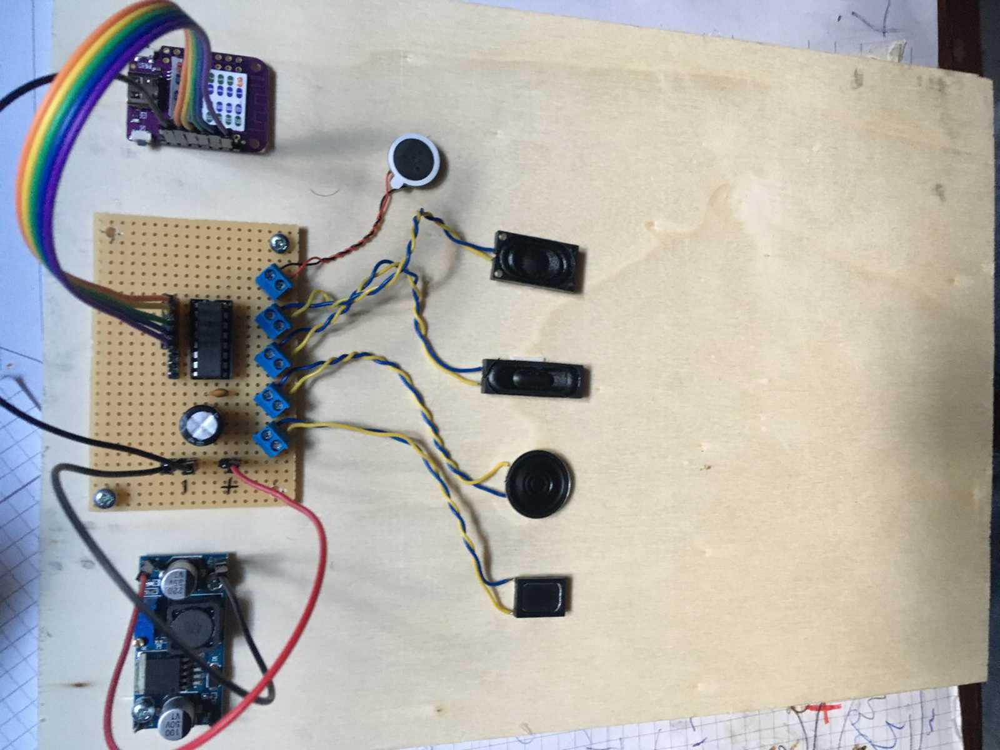

# Mobile-device-for-deafblind-people
(Eine Beschreibung der Markdown Formatierung für die Datei findet sich [hier](https://github.com/adam-p/markdown-here/wiki/Markdown-Cheatsheet)
## Motivation
The biggest problem for deafblind people is social isolation.
Ofcourse they can read books printed in Braille or write a letter using a Braille keyboard, but this is not the same as talking with somebody.
## The aim of the project
is to provide a technical solution which allows deafblind people to talk with somebody as similar to a normal talk as possible. 
## The 5 bit code
 
## System requirements
The system shall allow for full duplex communication  
The system shall use the haptic capabilities of the human fingers  
There shall be one device to be used with one hand for sending the information  
There shall be a second device to be used with the other hand for receiving the information  
In buildings the communication link between devices shall use WLAN  
In the field the system shall use mobile  infrastructure like 4G and 5G.  
The devices shall use Bluetooth to connect to mobile phones as links to the mobile infrastructure      
Sender and receiver device shall be designed with best ergonomic properties in mind  
The sender device shall have 5 contacts, one for each finger  
The contacts shall provide haptic feedback when pressed  
The receiver device shall have 5 contacts, one for each finger  
The contacts shall provide a haptic feedback when an information is sent to that finger.  
The kind of haptic feedback shall allow for use over several quarters of an hour without leading to artifacts in the sensation of the fingers.   
## System architecture - Top Level

### Power supply
The devices shall be able to operate from batteries (rechargeable).  
Battery lifetime tbd h (reasonable/acceptable)
### Performance
The devices shall be capable of processing at least 10 keystrokes per seconds   
## Pictures of some prototypes built so far
Evaluation of technical and ergonomic concepts  
     

